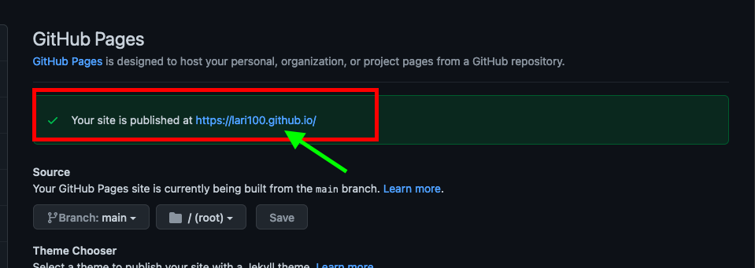
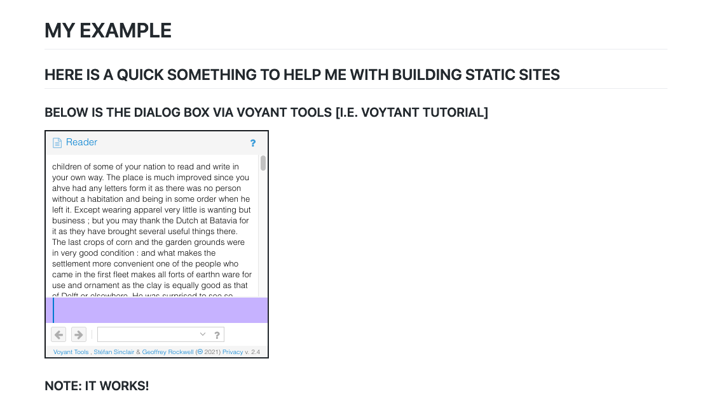

# EXAMPLE 

## My Quick Static Site

This is a site I build with gh-pages. **Wow**

It reads [markdown](https://www.markdownguide.org/) and turns it into html.

# MY EXAMPLE 

## HERE IS A QUICK SOMETHING TO HELP ME WITH BUILDING STATIC SITES 

### BELOW IS THE DIALOG BOX VIA VOYANT TOOLS [I.E. VOYTANT TUTORIAL] 

<iframe style='width: 353px; height: 360px;' src='https://voyant-tools.org/tool/Reader/?start=5930&skipToDocId=a5d7fab8caddb1f82d9cf7527287a1cd&corpus=efc9177c6ed9da50f93d71dfe8e6d1ea'></iframe>

### **NOTE: IT WORKS!** 

 

 

### **&**

This [GitHub page](https://docs.github.com/en/pages/getting-started-with-github-pages/creating-a-github-pages-site#creating-your-site) helped me navigate the steps. 

Just seeing if the following link works here: 

<iframe title="[ Total # of Countries ]" aria-label="Column Chart" id="datawrapper-chart-rHj9D" src="https://datawrapper.dwcdn.net/rHj9D/2/" scrolling="no" frameborder="0" style="border: none;" width="600" height="606"></iframe>
